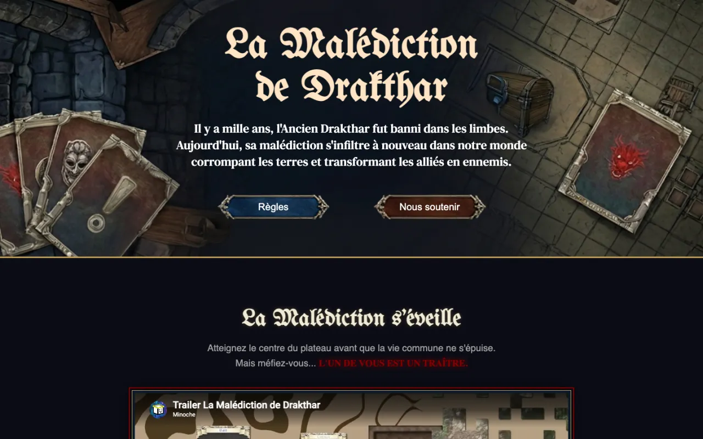

# La Malédiction de Drakthar


Site de présentation d'un jeu de plateau à rôle caché : univers, règles, matériel de jeu et projet de
financement participatif, sur une seule page.

Projet d'équipe réalisé pour l'Epic Digital Day (2026).

<p align="center">
  
</p>

## Le jeu

Un hybride entre **dungeon crawler** et **jeu à rôles cachés**. Les joueurs coopèrent pour atteindre
le centre du plateau avant que leur réserve de vie commune ne tombe à zéro — mais l'un d'eux,
désigné secrètement en début de partie, est un traître qui cherche à faire échouer le groupe.

- **Mise en place** : chaque joueur reçoit 3 cartes Objet ; la réserve de vie commune compte 5 jetons.
- **Tour de jeu** : avancer d'une case, puis effectuer une action :
  - **combattre** — piocher une carte Mob ; une victoire rapporte une carte Objet, une défaite coûte
    1 point de vie à tout le groupe ;
  - **donner un objet** à un autre joueur, sans dépasser 5 cartes Objet en main.
- **Fin de partie** : victoire quand tous les joueurs ont atteint le centre, défaite si la réserve
  de vie tombe à 0.

Règles complètes : [`img/Règles.pdf`](img/Règles.pdf).

## Le site

Une page unique organisée en sections :

| Section | Contenu |
|---|---|
| Accueil | Titre, accroche narrative, accès aux règles et au soutien |
| Teaser | Bande-annonce vidéo intégrée |
| Plateau | Illustration et présentation du plateau |
| Boîte de jeu | Modèle 3D interactif de la boîte (Sketchfab) |
| Cartes | Les cinq types de cartes : Événement, Boss, Mob, Objet, Rôle |
| Règles | Mise en place, tour de jeu, actions et règles spéciales |
| Pourquoi investir | Concept, public visé (14-35 ans), prix public (25,99 €) |
| Budget | Répartition des coûts et objectif de financement (15 000 € pour 1 000 boîtes) |
| Paliers | Six niveaux de contribution, de 10 € à 100 € |

### Réalisation

- **HTML et CSS uniquement**, sans framework ni JavaScript.
- **Palette centralisée** dans des variables CSS (`:root`).
- **Responsive** : mises en page Flexbox et points de rupture à 480, 768, 900 et 1 024 px.
- **Animations CSS** (`@keyframes`) : pulsation du texte « traître », boutons flottants.
- **Chargement différé** (`loading="lazy"`) des images et de la vidéo.
- Polices Google Fonts (*DM Serif Text*, *UnifrakturMaguntia*) et icônes Font Awesome.

## Lancer le site

Aucune installation : ouvrir `index.html` dans un navigateur.
Une connexion Internet est nécessaire pour les polices, la vidéo et le modèle 3D.

## Structure

```
index.html        Page unique
style.css         Styles, variables et points de rupture
img/
├── cards/        Dos des cinq types de cartes
├── board.png     Plateau de jeu
├── title.png     Logo
└── Règles.pdf    Règles complètes
docs/             Capture utilisée dans ce README
```

## Équipe

Loïc Chau, Antoine Collin, Amine Ati, Sarah Yangasa, Kilian Foucault, Paul Féry.

Dépôt maintenu par [Paul Féry](https://github.com/minoche95). Tous droits réservés © 2026.
